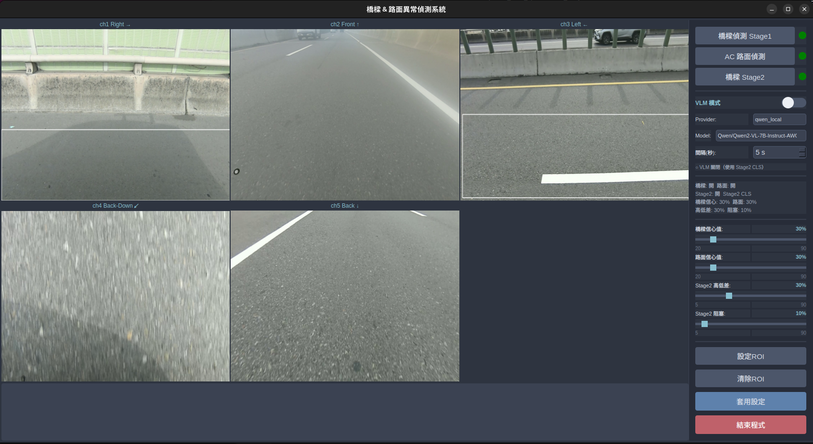

# 橋樑 & AC 路面異常偵測系統

部署於消防車的 5 路相機即時偵測系統，整合橋樑結構異常偵測（兩階段 YOLO）與 AC 路面破損偵測，提供 PyQt5 GUI 操作介面。消防車是巡檢平台，**偵測對象是橋樑結構與路面，而非車輛本身**。

本 branch（`AC_road_inference_ROS`）加入 AC 路面推論，並提供完整 ROS1 移植指南。



---

## 目錄

- [系統功能](#系統功能)
- [相機配置](#相機配置)
- [偵測邏輯](#偵測邏輯)
- [系統需求](#系統需求)
- [安裝](#安裝)
- [執行](#執行)
- [設定檔](#設定檔)
- [單張圖片測試](#單張圖片測試)
- [本地 LLM（Qwen）部署](#本地-llmqwen部署)
- [架構](#架構)
- [ROS 版本](#ros-版本)

---

## 系統功能

| 模組 | 說明 |
|------|------|
| 橋樑偵測 Stage 1 | 5 路相機全覆蓋，YOLOv11 偵測 10 類構件異常（剝落、鏽蝕、破損護欄等） |
| AC 路面偵測 Stage 1 | ch2（前）/ ch5（後）兩路，YOLOv11 偵測 4 類路面破損 |
| Stage 2 CLS | ch1/ch3 伸縮縫高低差分類、ch4 伸縮縫阻塞分類（YOLO-CLS） |
| VLM Stage 2（選用） | 以本地 Qwen / Gemini / Claude 取代 CLS，進行語意確認 |

**GUI 功能：**
- 5 路相機即時畫面（3×2 格局）
- 各模組啟用 / 停用開關
- 橋樑 / 路面 / Stage 2 信心值滑桿（即時生效，無需重啟）
- VLM Provider / Model / 送件間隔動態切換
- 每路相機獨立 ROI 設定
- 異常事件 log（點擊可檢視 annotated 圖片）

---

## 相機配置

| Channel | 安裝位置 | 主要用途 |
|---------|----------|---------|
| ch1 | 右側（Right） | 橋樑右側結構、伸縮縫高低差（Stage 2） |
| ch2 | 前方（Front） | AC 路面破損偵測 |
| ch3 | 左側（Left） | 橋樑左側結構、伸縮縫高低差（Stage 2） |
| ch4 | 後下方（Back-Down） | 伸縮縫俯拍、阻塞分類（Stage 2） |
| ch5 | 後方（Back） | AC 路面破損偵測 |

---

## 偵測邏輯

### Stage 1 — 橋樑（10 類，全 5 路）

| cls | 名稱 | 狀態 | 顯示色 |
|-----|------|------|--------|
| 0 | spalled concrete | 異常 | 紅 |
| 1 | corroded bolt | 異常 | 紅 |
| 2 | expansion joint | 正常 | 綠 |
| 3 | normal drainage hole | 正常 | 綠 |
| 4 | abnormal drainage hole | 異常 | 紅 |
| 5 | normal bolt | 正常 | 綠 |
| 6 | block expansion joint | 異常 | 紅 |
| 7 | rust steel pipe | 異常 | 紅 |
| 8 | barrier damage | 異常 | 紅 |
| 9 | blocked drainage hole | 異常 | 紅 |

### Stage 1 — AC 路面（4 類，僅 ch2 / ch5）

模型偵測 cls 0–3（crack / pothole 類型），全部視為需通報。
bbox 中心 y > 0.5 × 影像高度的框會被過濾（防止近車頭大面積誤檢）。

### Stage 2 — 條件式分類（YOLO-CLS）

Stage 1 偵測到 cls 2（expansion joint）或 cls 6（block expansion joint）時觸發：

| Channel | Stage 2 模型 | 輸入 | 結果 |
|---------|-------------|------|------|
| ch1, ch3 | `expansion_joint_height_cls` | 裁切後的 bbox | top1=0（height_difference）→ cls 改寫為 6 |
| ch4 | `expansion_joint_gap_cls` | 整張影像 | top1=0（abnormal_expansion_joint）→ cls 改寫為 6 |

**ch4 額外規則**：最終只顯示 cls 6，其餘類別全部過濾（ch4 為伸縮縫俯拍專用相機）。
ch1 / ch3 畫面左上角同步疊加 ch4 gap 分類結果文字。

---

## 系統需求

| 項目 | 需求 |
|------|------|
| OS | Linux（Ubuntu）或 Windows |
| Python | 3.11（conda 環境） |
| GPU | 建議 8 GB VRAM 以上 |
| CUDA | 12.x 以上 |
| 本地 LLM（選用） | 額外約 7 GB VRAM |

---

## 安裝

### 1. 建立 conda 環境

```bash
conda create -n multi-task_detection python=3.11 -y
conda activate multi-task_detection
```

### 2. 安裝 PyTorch（CUDA 13.0）

```bash
pip install torch torchvision --index-url https://download.pytorch.org/whl/cu130 \
    --trusted-host download.pytorch.org --trusted-host download-r2.pytorch.org
```

> 本機 SSL 憑證問題需加 `--trusted-host`，環境正常可省略。

### 3. 安裝其他套件

```bash
pip install -r requirements.txt \
    --trusted-host pypi.org --trusted-host files.pythonhosted.org
pip install "numpy<2" "opencv-python-headless<4.9" \
    --trusted-host pypi.org --trusted-host files.pythonhosted.org
```

> `numpy<2` 為 matplotlib 3.7 的相容性需求。

### 4. 放置模型權重

將 `.pt` 檔案放入 `firetruck_detection/weights/`：

| 檔名 | 用途 |
|------|------|
| `2026-04-01-yolov11s-2-phase.pt` | 橋樑 Stage 1（10 cls） |
| `2026-03-03-yolov11-road-damage.pt` | AC 路面 Stage 1（4 cls） |
| `2025-07-02-expansion_joint_height_cls.pt` | Stage 2 高低差（ch1/ch3） |
| `2025-07-02-expansion_joint_gap_cls.pt` | Stage 2 阻塞分類（ch4） |

---

## 執行

```bash
conda activate multi-task_detection
bash run.sh
```

或直接執行：

```bash
cd firetruck_detection
python main.py
```

---

## 設定檔

主設定檔：`firetruck_detection/cfg/default_settings.yaml`
執行期覆蓋（GUI 自動寫入）：`firetruck_detection/cfg/my_last_settings.yaml`

### 關鍵參數

```yaml
detection_modules:
  bridge:
    enable: true
    channels: [ch1, ch2, ch3, ch4, ch5]
    weight: '2026-04-01-yolov11s-2-phase'   # weights/ 下的檔名（不含 .pt）
    conf: 0.3
    stage2:
      enable: true
      method: 'yolo_cls'                     # 'yolo_cls' | 'vlm' | 'none'
      trigger_class_ids: [2, 6]
      per_channel:
        ch1: { weight: '2025-07-02-expansion_joint_height_cls', task: height }
        ch3: { weight: '2025-07-02-expansion_joint_height_cls', task: height }
        ch4: { weight: '2025-07-02-expansion_joint_gap_cls',    task: gap }
  road_damage:
    enable: true
    channels: [ch2, ch5]
    weight: '2026-03-03-yolov11-road-damage'
    conf: 0.3

channel_rules:
  ch4:
    bridge_allowed_class_ids: [6]     # back-down 只顯示 cls 6
  ch2:
    road_filter_bbox_y_ratio: 0.5    # bbox 中心 y > 0.5H 則過濾
  ch5:
    road_filter_bbox_y_ratio: 0.5

source: 0                             # 0 = 影片檔，1 = RTSP 串流
test_video_dir: /path/to/videos       # 需含 ch1/ ch2/ ch3/ ch4/ ch5/ 子資料夾
```

### VLM 設定（選用）

```yaml
vlm:
  provider: qwen_local                # qwen_local | gemini | claude
  model: Qwen/Qwen2-VL-7B-Instruct-AWQ
  api_key_gemini: ""                  # Google AI Studio
  api_key_claude: ""                  # Anthropic Console
  qwen_base_url: "http://127.0.0.1:8000/v1"
  cooldown_sec: 5                     # 每路相機最短送件間隔（秒）
```

---

## 單張圖片測試

```bash
conda activate multi-task_detection
cd firetruck_detection/test
python single_image_test.py
```

對 `image_under_test.jpg` 執行 Stage 1 偵測 → 裁切 → Stage 2 分類，輸出 `cropped.jpg` 與 `annotated_image_under_test.jpg`。
執行前請確認 `single_image_test.py` 的 `__main__` 中的模型檔名與 `../weights/` 內的檔名一致。

---

## 本地 LLM（Qwen）部署

```bash
# 終端機 1：啟動 vLLM server
bash start_vllm.sh

# 終端機 2：啟動偵測系統
bash run.sh
```

啟動後在 GUI 將 Stage 2 method 切換為 `vlm`，provider 設為 `qwen_local`。
VLM 結果為非同步，僅出現在 GUI log 與儲存的 annotated 圖片中，不影響即時畫面。

---

## 架構

MVC 設計模式，預設以單一 batch inference 執行緒處理全部 5 路。

```
firetruck_detection/
├── main.py                    # 程式入口：Detection → DetectionGUI → DetectionController
├── model/
│   ├── detection.py           # 頂層 Model：管理 5 個 Detector、共用 batch inference 執行緒
│   ├── detector.py            # 單路 worker：fetch_thread + result_thread
│   ├── post_processing.py     # Stage 2 YOLO-CLS（PostProcessingWorker）
│   └── vlm_worker.py          # VLM Stage 2：per-channel queue + cooldown
├── view/detection_gui.py      # PyQt5 GUI
├── controller/controller.py   # DetectionController：橋接 Model ↔ View
├── utils/
│   ├── __init__.py            # 系統常數（NUM_VIDEO_STREAMS、CAMERA_DIRECTIONS 等）
│   ├── detection_logger.py
│   ├── screen_shot.py
│   └── yaml_operation.py
├── cfg/
│   ├── default_settings.yaml  # 主設定檔
│   └── my_last_settings.yaml  # GUI 執行期自動寫入
└── weights/                   # 模型權重（.pt）
```

### 執行緒模型

```
Detection._inference_worker（1 執行緒）
  ├── bridge_model([f1~f5], batch=5)   → 各路 bridge 結果
  ├── road_model([f2, f5], batch=2)    → ch2/ch5 路面結果
  └── workers[i].result_queue.put(...)

每路 Detector（共 5 個 worker）：
  ├── fetch_thread   — 從 VideoStream 讀取最新 frame
  └── result_thread  — 處理結果、繪製 bbox、觸發 Stage 2 / VLM
```

---

## ROS 版本

`smaple/MIGRATION_GUIDE.md` 提供完整 ROS1（Noetic）移植指南，說明如何將本系統移植為單一整合節點（`multi_camera_detection_node.py`），不含 GUI、LLM、email、Web API。

### 架構差異

| 維度 | PyQt5 版本（本專案） | ROS 版本 |
|------|---------------------|---------|
| 相機輸入 | VideoStream（影片 / RTSP） | ROS topic（`sensor_msgs/Image`） |
| 影像同步 | 各路獨立 fetch_thread | `ApproximateTimeSynchronizer`（slop 0.05 s） |
| GUI | PyQt5（5 路畫面） | 無（`rqt_image_view` 觀察） |
| VLM | VLMWorker 支援 | 不移植 |
| 輸出 | GUI log / 存圖 | ROS topics（BoundingBoxes / Image） |

### ROS 輸出 Topics（每路）

```
/yolov8/{direction}/BoundingBoxes              # 橋樑全部 bbox
/{direction}/detection_image                   # 標註影像
/{direction}/filter_image_bbox                 # 僅異常類別（含影像）

/yolov8/{direction}/BoundingBoxes_road_damage  # 路面 bbox（ch2/ch5 限定）
/{direction}/detection_image_road_damage
/{direction}/filter_image_bbox_road_damage
```

### ROS 快速啟動（Docker container `ros_yolo_bridge`）

```bash
# 編譯
cd /catkin_bridge_ws
catkin_make -DPYTHON_EXECUTABLE=/usr/bin/python3.8
source devel/setup.bash

# 播 rosbag（-l 循環，-r 0.5 半速）
rosbag play -l -r 0.5 /workspace/your_recording.bag

# 啟動偵測節點
LD_PRELOAD=/usr/lib/x86_64-linux-gnu/libffi.so.7 \
  roslaunch yolov8_ros yolo_v8_multi_camera_unified.launch device:=cuda
```

> **shebang**：節點必須為 `#!/opt/conda/envs/yolov8_rtx5090/bin/python3.10`（RTX 5090 / sm_120 需 PyTorch 2.7+）。
> **`LD_PRELOAD`**：修正 conda libffi 與系統 libp11-kit 的符號衝突，每次啟動前必加。

詳細說明請參閱 [`smaple/MIGRATION_GUIDE.md`](smaple/MIGRATION_GUIDE.md)。
